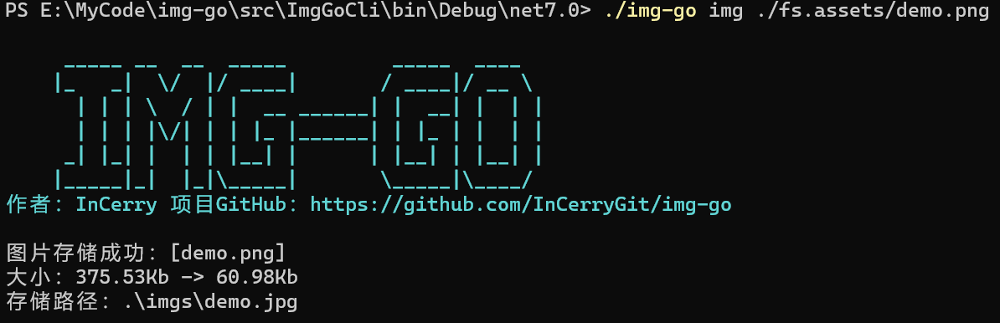

# IMG-GO

[TOC]

**国内镜像地址：https://gitee.com/InCerryGit/img-go**

## 一、简介
这个功能是笔者平时用来写文章的工具，使用Markdown编辑插入的图片会默认保存到本地备份，发布到简书、博客园及其他网站时需要将Markdown文件内的图片上传，**非常繁琐**！！ 而这个工具能非常简单的将Markdown文件中的图片**提取、加水印、压缩和上传到指定的图床**，另外也支持对图片文件及文件夹处理。

目前支持以下图床：

| 对象存储       | 控制台及配置名称  |
|------------|-----------|
| 本地存储       | Local     |
| 阿里云 OSS存储  | AliyunOss |
| 七牛云 Kodo存储 | Qiniu     |


## 二、教程
### 安装方式

#### dotnet tool
具有 .NET Core/.NET6 SDK 环境可以直接使用命令安装：
```sh
dotnet tool install --global img-go
```
然后就可以直接使用它：


#### 下载编译后的程序

下载地址：https://github.com/InCerryGit/img-go/releases

某度网盘（国内用户）：https://pan.baidu.com/s/1mX8MEwx_xNnaxvGIHa0L8A?pwd=qzpk

如果您安装了.NET 6 Runtime那么可以下载不带运行时的版本，如下方标记的那个版本，它体积非常小：


如果没有安装.NET 6 Runtime，那么请下载对应平台版本，如win-x64、linux-x64等等：


### 使用方式
#### 配置

由于图床的配置很多，所以需要一个小的配置文件帮助我们更容易的使用它。配置文件一般和程序放在同一个目录下，**默认叫`appconfigs.json`**，在没有指定配置文件的情况下，程序会**优先读取同目录的配置文件**，如果**不存在则读取用户目录文件**，用户目录文件在不同平台下都不一样。可以使用`img-go config -c user`命令创建默认的配置文件，**然后手工编辑它**。


下面是默认的配置文件的详解：

```json5
{
  "AddWatermark": true,             // 是否添加水印【默认参数，命令行可通过-w覆盖它】
  "CompressionImage": true,         // 是否压缩图片【默认参数，命令行可通过-cp覆盖它】
  "DefaultBlobStore": "Local",      // 对象存储仓库与BlobStores中配置一致，目前支持AliyunOss、Qiniu和Local本地存储【默认参数，命令行可通过-s覆盖它】
  // 存储仓库的配置
  "BlobStores": {
    // 本地存储 - 可做测试使用
    "Local": {
      "DirectoryPath": ".\\imgs"    // 存储路径
    },
    // 七牛云
    "Qiniu":{
      "Zone":"z2",             // 存储区域 https://developer.qiniu.com/kodo/1671/region-endpoint-fq
      "UseHttps":false,        // 是否使用https
      "UseCdnDomains":false,   // 是否使用CDN加速
      "Bucket":"Bucket",       // 你设置的Bucket
      "AccessKey":"AccessKey", // 你的AccessKey
      "SecretKey":"SecretKey", // 你的SecretKey
      "AccessUrl":""		   // 你的自定义的域名
    }
    // 下面可以配置其它图床
  },
  // 关于图片处理的配置
  "ImageConfigs": {
    "SkipNotSupportFormat": true,         // 遇到不支持的图片类型是否跳过，否则就抛异常终止
    "WatermarkText": "InCerry",           // 水印文字
    "WatermarkFontSize": 30,              // 水印文字大小，如果图片小于文字大小，那么会缩放
    "WatermarkFont": "Microsoft Yahei",   // 使用的字体类型，默认使用微软雅黑，Mac和Linux用户可自行配置系统安装的字体
    "WatermarkFontColor": "#FFF",         // 字体颜色
    "CompressionLevel": "Low",            // 压缩级别
    "ConvertFormatTo": "jpg"              //  是否转换格式，支持一些常见的图片格式，如果不想转换，填null即可 如："ConvertFormatTo": null
  }
}
```
##### 七牛云配置信息

Json配置项和说明：

```json5
// 七牛云
"Qiniu":{
  "Zone":"z2",             // 存储区域 完整的存储区域看这里 https://developer.qiniu.com/kodo/1671/region-endpoint-fq
  "UseHttps":false,        // 是否使用https
  "UseCdnDomains":false,   // 是否使用CDN加速
  "Bucket":"Bucket",       // 你设置的Bucket
  "AccessKey":"AccessKey", // 你的AccessKey
  "SecretKey":"SecretKey", // 你的SecretKey
  "AccessUrl":"AccessUrl"		   // 你的自定义的域名，需要注意是http还是https访问
}
```

对应的密钥信息需要到七牛自己的[控制台](https://portal.qiniu.com/user/key)里找到。其中需要注意的是，自己的存储空间的区域需要确定：


##### 阿里云Oss的配置信息

Json配置项和说明：

```json5
// 阿里云Oss图床
"AliyunOss": {
  "Endpoint": "https://oss-cn-hangzhou.aliyuncs.com",   // 阿里云Oss区域URL，我这里设置的是杭州区域
  "AccessKey": "AccessKey",                             // 你的AccessKey
  "AccessKeySecret": "AccessKeySecret",                 // 你的AccessKeySecret
  "BucketName": "BucketName"                            // 你的BucketName
}
```

在控制台中寻找配置项。


#### 帮助信息

无论在什么情况下，`-h`命名就可以显示帮助信息，比如`img-go -h`：


#### 处理Markdown文件图片

如上图中的`Commands`节点提示一样，处理Markdown文件的命令是`img-go md 文件路径`，如果不会可以`-h`，会弹出各个参数的说明：


我们有一个叫`fs.md`的Markdown文件，可以使用它来处理。然后我需要添加水印和压缩图片大小，命令使用`img-go md ./fs.md -w -cp `：


然后可以看到创建了一个名为`fs-Local.md`文件，打开图片文件夹**格式转换为了jpg**、**大小也有下降**、另外如下图所示打上了水印：


#### 处理图片

如上面中提到的`Commands`节点提示一样，处理Markdown文件的命令是`img-go img 接文件或目录路径`，如果不会可以`-h`，会弹出各个参数的说明，基本和处理markdown文件一样：


#### 处理单个图片

我们有一个`demo.png`文件，由于上面的配置文件已经配置了**压缩**和**水印**，所以我们可使用`img-go img ./fs.assets/demo.png`来处理单个图片。




#### 处理图片目录

我们有`fs.assets`图片文件夹，我们想把它压缩和水印处理后上传到阿里云中，由于上面的配置文件已经配置了**压缩**和**水印**，所以我们只需要加`-s AliyunOss`指定上传阿里云即可。最终命令`img-go img ./fs.assets -s AliyunOss`来处理这个文件夹。

注意：**它会尝试给文件夹内的所有文件进行压缩和水印操作，失败则跳过，但是同样会上传**。比如下面的**`*.svg`文件并不支持处理**，但是还是会上传到阿里云中。


来查看一下阿里云Oss后台：


## 三、其他说明

- 程序未加过多的容错机制，请勿暴力测试。
- 上传图片具有重试机制，重试三次。
- 只有本地路径的图片才会上传，所有http/https远程图片都会过滤。
- 暂不支持博客园上传，如果需要博客园那么可以使用这个工具 https://github.com/stulzq/dotnet-cnblogs-tool

